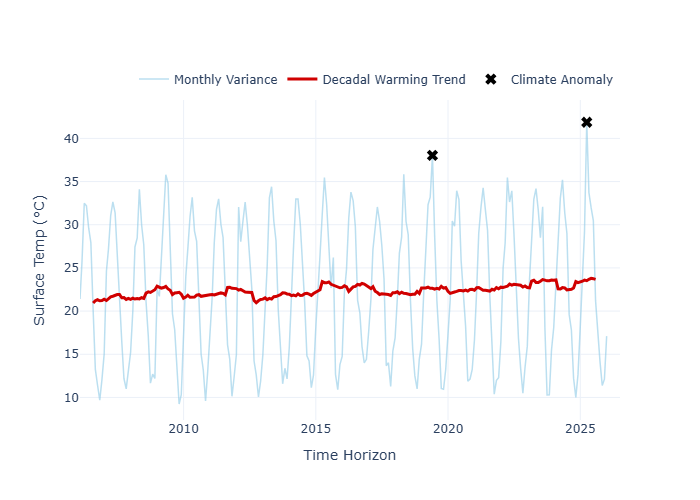
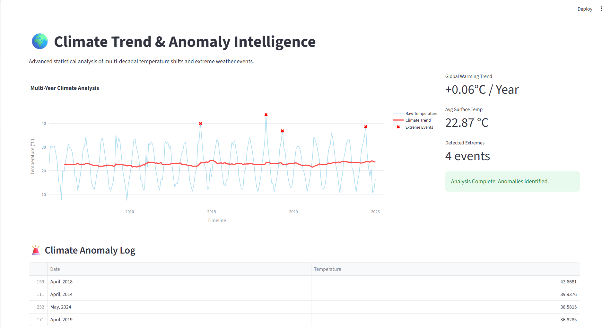

# 🌍 Climate Trend & Anomaly Intelligence


An advanced Data Science dashboard designed to analyze multi-decadal temperature shifts. This project focuses on separating seasonal noise from long-term warming signals and identifies extreme climate events using statistical modeling.

---

## 🚀 Key Features
- **Modular Data Engine:** Logic is decoupled into a dedicated `data_engine.py` for professional-grade code management.
- **Trend Decomposition:** Implements a 12-month centered rolling average to reveal underlying climate trends.
- **Statistical Anomaly Detection:** Employs Z-Score calculations (1.8σ threshold) to flag and log extreme heatwaves.
- **Interactive Visualization:** High-fidelity, responsive Plotly charts with unified hover effects.
- **Automated Reporting:** Every execution syncs and exports an anomaly report (CSV) to the `outputs/` directory.

## 📊 Project Visuals

<p align="center">
  
</p>

<p align="center">
  
  
</p>
## 🛠️ Tech Stack
- **Core Engine:** Python, Pandas, NumPy
- **Statistics:** Time-Series Smoothing, Z-Score Anomaly Detection
- **Dashboard UI:** Streamlit Framework
- **Visualization:** Plotly (Interative Graphs)

---

## 📂 Project Structure
```text
Climate-Trend-Analyzer/
├── app/
│   ├── main.py            # Streamlit Dashboard UI logic
│   └── data_engine.py     # Backend Statistical Processing Engine
├── outputs/               # Auto-generated CSV reports and Snapshots
├── requirements.txt       # Environment dependencies
├── dashboard_ss.png       # Documentation Screenshot
└── README.md              # Project Documentation (Current File)

⚙️ Setup & Installation
1. Clone the Repository:

Bash
git clone [https://github.com/your-username/Climate-Trend-Analyzer.git](https://github.com/your-username/Climate-Trend-Analyzer.git)
cd Climate-Trend-Analyzer
2. Create & Activate Virtual Environment:

Bash
python -m venv .venv
# On Windows:
.\.venv\Scripts\activate
3. Install Dependencies:

Bash
pip install -r requirements.txt
4. Run the Application:

Bash
python -m streamlit run app/main.py
📊 Methodology
Simulation: Generates 20 years of high-fidelity synthetic data with seasonal sine-waves and linear warming trends.

Analysis: Isolates the "Warming Gradient" by eliminating monthly volatility via rolling windows.

Thresholding: Specifically flags data points that fall outside the 1.8 Standard Deviation range as extreme anomalies.

📷 Project Preview
🤝 Connectivity
Developed by [DALIM KUMAR 
] Passionate about Environmental Data Science and Business Intelligence. LinkedIn | Portfolio